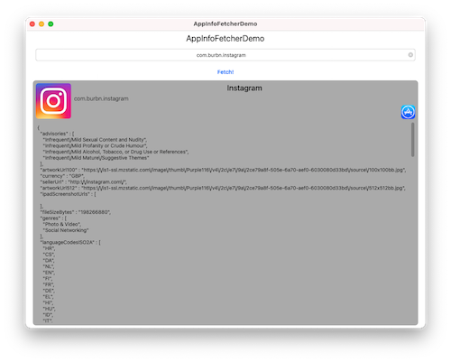
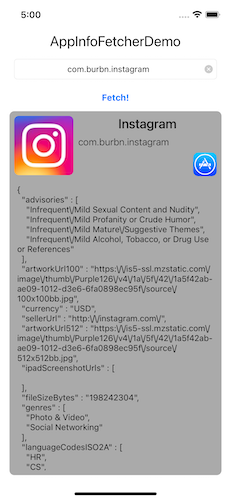

# AppInfoFetcher

[](https://cocoapods.org/pods/AppInfoFetcher)
[](https://cocoapods.org/pods/AppInfoFetcher)
[](https://cocoapods.org/pods/AppInfoFetcher)

**AppInfoFetcher** is a simple, Swift library for performing App store connect metadata lookup for iOS apps present on the Apple app store.
Given an app's bundle identifier the library returns all the app's metadata in a complete model.

## Features
- [x] Fully typed model
- [x] Optional data Cache
- [x] Custom store country support

## Example

Example preojects are available for **Cocoapods** and **SPM**

  

## Installation

### Cocoapods

```ruby
pod 'AppInfoFetcher'
```

### Swift package manager

Add you github account to Xcode and search for `AppInfoFetcher` or ...


## Usage

```swift
let bundleID = "com.burbn.instagram"
AppInfoFetcher().fetchInfo(bundleIdentifier: bundleID, useCache: true, countryCode: "GB") { result in
    switch result {
    case.success(let appsInfo):
         // Use the array of AppInfo here
    case .failure(let error):
        print(error)
    }
}
```

- **Cache**: If the cache is used only one API call is performed for a bundle identifier
- **Country code**:  If not specified the country code is extracted from the `Locale.current`

### Using `AppInfo`

The `AppInfo` model contains a lot of informations like:

- App name: `.trackCensoredName`
- App store URL: `.trackViewURL`
- App icon URL: `.artworkUrl100`

## Author

Federico Cappelli

## License

AppInfoFetcher is available under the Apache 2.0 license. See the LICENSE file for more info.
